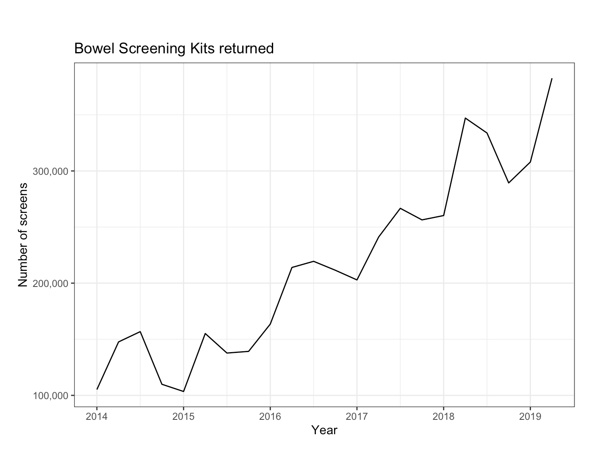
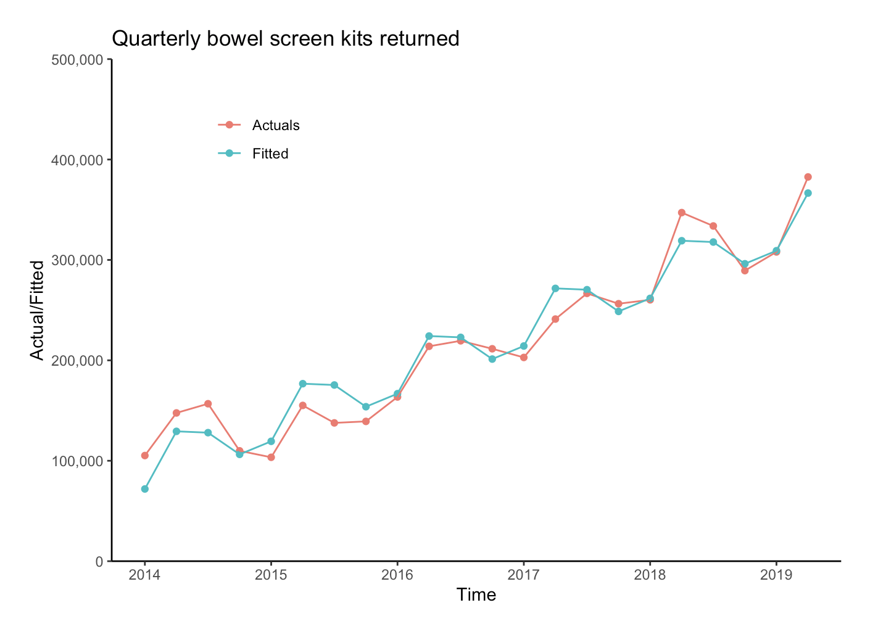
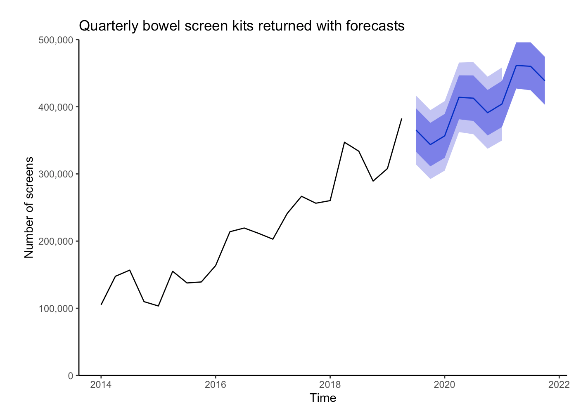

This R markdown demonstrates predictive analysis for time series data. 
For this analysis we use the Bowel Cancer Screening dataset.The data for this analysis was taken from https://www.aihw.gov.au/reports/cancer-screening/national-cancer-screening-programs-participation/data. 
A copy of that [data](https://github.com/IshK09/bowelscreening/blob/master/bowel%20screening%20data.xlsx) is also available in this repo. 

The code is located in the file [Bowel Screen Time Series.Rmd](https://github.com/IshK09/bowelscreening/blob/master/Bowel%20Screen%20Time%20Series.Rmd)

We see how many tests were performed over the years

Plot of the actual and fitted values

Forecasts

